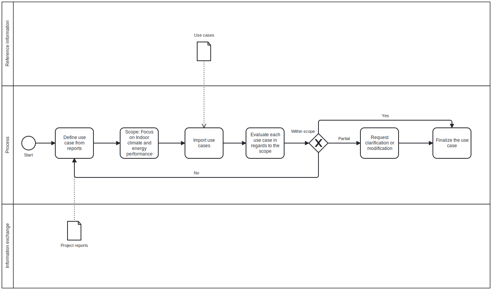

# BIMmanager group 18

Focus area:
Indoor (and Energy)

Use case: BIM analysis Toolkit - Indoor Climate and Energy Focus

Project Scope:
Development of af Python based toolkit to analyse IFC models with focus on Indoor climate and energy performance and confirming compliance with other stakeholders claims and regulations. The analysis includes among others things, a chack of free storage heights, pressure loss in ventilations systems, and U-values assesment of building envelope.

THE SUBMODULES IN EXTERNAL IS NOT WORKING PROBABLY, USE THE LINKS BELOW INSTEAD:

Group 13:
Link: https://github.com/s223928/Group-13.git

Group 15:
Link: https://github.com/Kolde16/Group-15.git

Group ApocalypseBIM (Group 12): Link: https://github.com/teiturteitur/ApocalypseBIM.git

